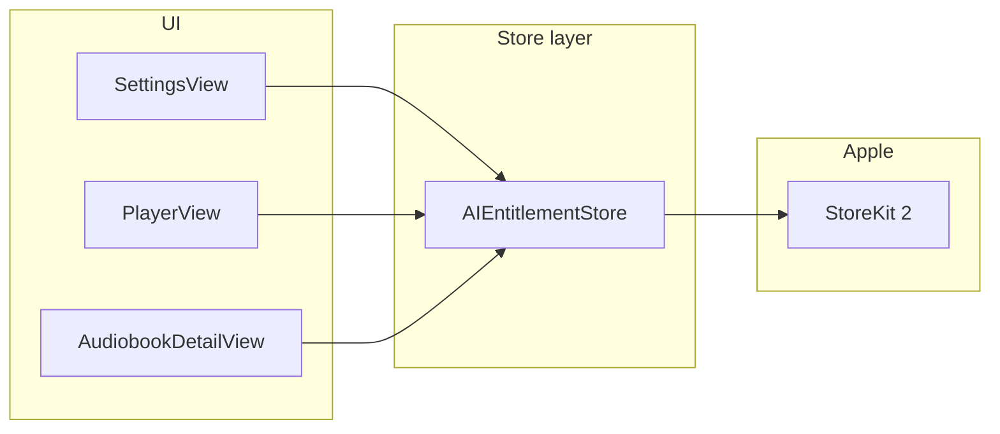

# Non-consumable AI unlock (€3.99) — plan

## Context

- **AI today**: Smart moment naming (`[PlayerView.swift](Ebooker/Views/PlayerView.swift)` → `[PlayerViewModel](Ebooker/ViewModels/PlayerViewModel.swift)` + `[MomentNamingService](Ebooker/Services/MomentNamingService.swift)`) and smart summary/recap (`[AudiobookDetailView.swift](Ebooker/Views/AudiobookDetailView.swift)` → `[AudiobookDetailViewModel](Ebooker/ViewModels/AudiobookDetailViewModel.swift)` + `[RecapService](Ebooker/Services/RecapService.swift)`). Both are already gated by `@AppStorage` (`useLocalAIFeatures`, `useSmartMomentNaming`, `useSmartSummary`) and `[AppleIntelligenceCapability.isSmartNamingAvailable](Ebooker/Services/AppleIntelligenceCapability.swift)`.
- **No StoreKit yet** (grep shows no `StoreKit` usage).
- **AI vs app OS version**: The on-device AI stack (Foundation Models / Apple Intelligence used by smart naming and recap) requires **iOS 18+** and **hardware that supports Apple Intelligence** — notably **iPhone 15 Pro and later** (not base iPhone 15), and **iPad models with M-series chips** (and similarly M-series Macs if you ever ship there). The app already reflects this via `[AppleIntelligenceCapability](Ebooker/Services/AppleIntelligenceCapability.swift)` and `[APPLE_FOUNDATION_MODELS.md](Ebooker/APPLE_FOUNDATION_MODELS.md)`. IAP code should **not** try to bypass those checks: purchasing only matters on devices where `isSmartNamingAvailable` can become true.
- **Project deployment target** (whatever Xcode is set to, e.g. a future SDK) is separate from the above; **StoreKit 2** remains the right API for the purchase layer on supported OS versions.

**Apple requirement**: Unlocking these in-app digital features must use **In-App Purchase**, not an external payment flow, for App Store distribution.

**Without a paid developer account yet**: You cannot create live IAP products or use Sandbox with real App Store Connect. You **can** still implement and test purchases locally with a **StoreKit Configuration** (`.storekit`) file attached to the Xcode scheme. After enrollment, you create the matching non-consumable in App Store Connect and use Sandbox testers.

**€3.99**: Set via **App Store Connect price tier** (closest tier to €3.99 in each region). The app should show the localized price with `Product.displayPrice`, not a hardcoded "3,99 €" string as the only price source.

---

## Architecture

- Add a **single `@MainActor` observable store** (e.g. `AIEntitlementStore`) that:
  - Loads the one **non-consumable** `Product` by a fixed **product ID** (constant in code, e.g. `com.yourcompany.ebooker.ai_unlock` — must match App Store Connect and the `.storekit` file).
  - Sets `isUnlocked` from `**Transaction.currentEntitlements`** (verified transactions only).
  - Starts a **background task** listening to `**Transaction.updates`** and re-checks entitlements after each verified update (purchase, restore, family sharing edge cases).
  - Exposes `**purchase()`** and `**restore()`** (restore = `AppStore.sync()` then re-scan entitlements; required UX for non-consumables).
- Inject the store from `[EbookerApp.swift](Ebooker/App/EbookerApp.swift)` via `**.environmentObject`** (same pattern as `AudioPlayerManager`).

**Gating rule** (additive to existing logic):

- `aiAvailableForPaidFeatures = entitlementStore.isUnlocked && AppleIntelligenceCapability.isSmartNamingAvailable`
- **Smart save** (`[PlayerView](Ebooker/Views/PlayerView.swift)` `useSmartSave`): require `aiAvailableForPaidFeatures && useLocalAIFeatures && useSmartMomentNaming` (current formula + `isUnlocked`).
- **Smart summary UI** (`[AudiobookDetailView](Ebooker/Views/AudiobookDetailView.swift)` `smartSummaryEnabled`): require `aiAvailableForPaidFeatures && useLocalAIFeatures && useSmartSummary`.

This keeps **Speech + local model** behavior unchanged once the user has paid and enabled settings; if the device does not support Apple Intelligence, paid unlock does not bypass that (consistent with today’s messaging).

---

## UI / UX

- `**[SettingsView.swift](Ebooker/Views/SettingsView.swift)`** (AI section):
  - Add a dedicated **purchase eligibility** check that is **narrower** than current runtime usability:
    - `canPurchaseAIUnlockOnThisDevice = deviceSupportsAppleIntelligenceHardwareAndOS`
    - This should be **separate** from `AppleIntelligenceCapability.isSmartNamingAvailable`, because current runtime availability also includes temporary/user-fixable conditions like Apple Intelligence being turned off, model still loading, or speech not being available right now.
  - If **not unlocked** and **purchase-eligible**: short explanation + primary button using `**product.displayPrice`** (fallback loading / error state).
  - If **not unlocked** and **device-ineligible**: do **not** show the buy button; instead show a static message that AI unlock requires **iOS 18+** and Apple Intelligence-capable hardware (e.g. **iPhone 15 Pro or later**, **M-series iPad**).
  - **Restore purchases** (secondary, required for App Review expectations on non-consumables).
  - If **unlocked**: keep existing toggles; optional small “Unlocked” label in footer.
  - Optionally **disable** the AI master toggle sub-features until unlocked, or show the paywall when they turn on “Use local AI features” — simplest is: **show purchase block at top of AI section** when locked, and treat toggles as inert or hidden until unlocked (pick one consistent pattern; recommend: show toggles disabled with footnote “Unlock to enable” to avoid confusion).
- **Optional**: lightweight paywall sheet reused from Settings if you want a tap target from elsewhere later; not strictly required if Settings is the only entry point for v1.

### Purchase restriction reality

- We can **block the in-app purchase UI and `purchase()` call** on devices that are clearly not eligible for Apple Intelligence.
- We generally **cannot make App Store Connect enforce device-model-specific IAP availability** for this single feature pack inside one iOS app.
- Practical result:
  - A user on an ineligible device should **not see a purchase button in-app**.
  - A purchase made on another eligible device under the same Apple ID can still be **restored / recognized** on the ineligible device, but the feature must remain unusable there because runtime AI checks still apply.

---

## Files to add

| File                                                                   | Purpose                                                                 |
| ---------------------------------------------------------------------- | ----------------------------------------------------------------------- |
| `Ebooker/Services/AIEntitlementStore.swift` (or `Ebooker/Purchases/…`) | StoreKit 2: load product, purchase, entitlements, `Transaction.updates` |
| `Ebooker/Configuration/AIProductID.swift`                              | Single `String` constant for product id                                 |
| `Ebooker/Configuration/Products.storekit` (optional but recommended)   | Local StoreKit test catalog: one non-consumable matching the ID         |

Wire **scheme** → StoreKit configuration in Xcode (manual step when implementing; document in a short comment near the product ID or in PR description, not a new markdown doc unless you ask).

---

## Files to change

- `[EbookerApp.swift](Ebooker/App/EbookerApp.swift)`: `@StateObject` / hold store, `.environmentObject(...)`.
- `[SettingsView.swift](Ebooker/Views/SettingsView.swift)`: purchase + restore + lock state for AI toggles.
- `[PlayerView.swift](Ebooker/Views/PlayerView.swift)`: `@EnvironmentObject` entitlement store; extend `useSmartSave` condition.
- `[AudiobookDetailView.swift](Ebooker/Views/AudiobookDetailView.swift)`: `@EnvironmentObject`; extend `smartSummaryEnabled`.

**Tests**: Optional follow-up — introduce a small protocol (e.g. `AIEntitlementChecking` with `var isUnlocked: Bool`) implemented by the real store and a test double, so view logic can be unit-tested without StoreKit. Not blocking for a first shippable implementation if you prefer minimal diff.

---

## After Apple approves your account

1. Sign **Paid Applications Agreement**, complete **banking and tax**.
2. In **App Store Connect** → your app → **In-App Purchases**: create a **Non-Consumable** with the **exact product ID** from code.
3. Set **price tier** targeting ~€3.99 in primary territories.
4. Add **review screenshot** and localized **display name / description** for the IAP.
5. Test with **Sandbox** Apple ID on device; then submit app + IAP for review.

---

## Risks / notes

- **Ineligible devices**: A user can still complete IAP on a device that never gets `AppleIntelligenceCapability.isSmartNamingAvailable` (e.g. older iPhone). Mitigate with clear **App Store Connect IAP description** and **in-app copy** that AI requires iOS 18+ and a compatible device (iPhone 15 Pro or later, M-series iPad, etc.).
- **Product ID is permanent** once submitted with the first binary; choose it carefully.
- **Family Sharing**: If you want family sharing for this non-consumable, enable it on the IAP in App Store Connect; StoreKit entitlements still drive `isUnlocked`.
- **Simulator**: StoreKit testing works with configuration file; physical device + Sandbox is the real validation before release.

