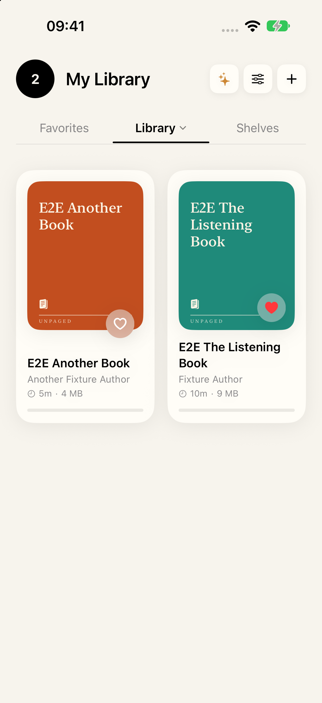
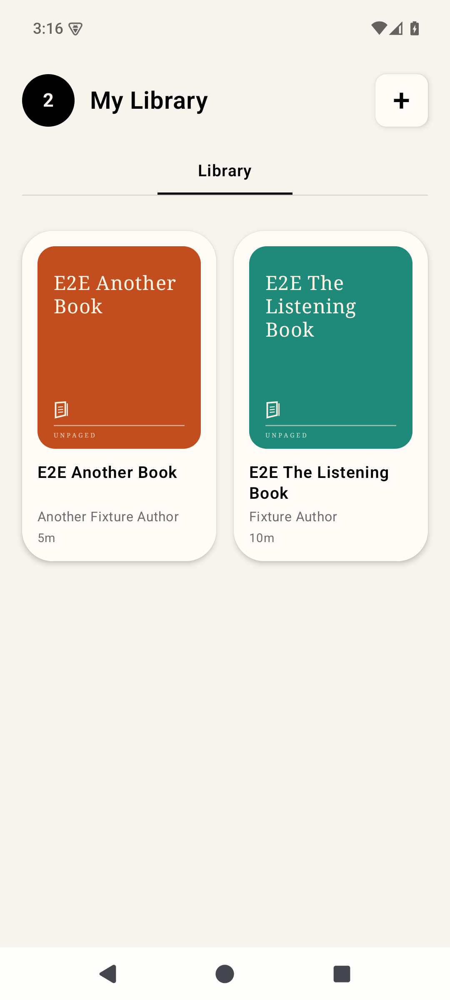
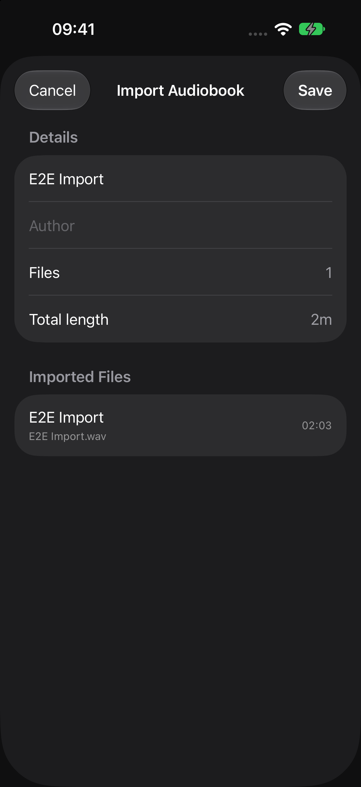
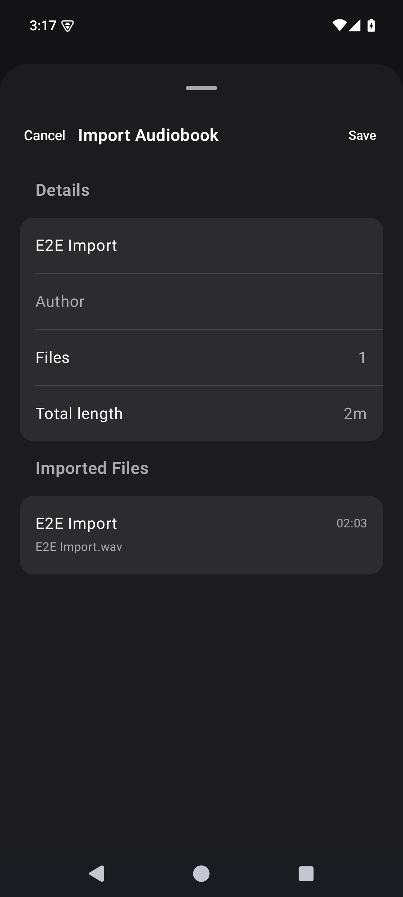

# Android E2E and visual validation — 2026-10-06

Follow-up to [local-library validation](local-library-validation-2026-10-06.md)
on `feat/android-local-library`, draft [PR #60](https://github.com/andreibalu/Ebooker/pull/60).
The implementation stays in the isolated Android worktree. No iOS source,
unfinished iOS E2E work, release metadata or shared simulator data was edited.

## Execution boundary

`android/e2e/` is a separate Android test module so its UI Automator driver
survives a real force-stop of the production app. Assertions observe visible
controls in the app and actual system document picker; there are no app fixture
hooks, test database calls or repository assertions. Generated 8kHz PCM WAV
files exercise Android's real `MediaExtractor`/`MediaMetadataRetriever` path.
`Invalid.mp3` contains text, deliberately failing media parsing.

The guarded runner requires one explicitly selected, booted `Unpaged_E2E_*`
emulator and refuses extra attached Android devices. Instrumentation checks its
approval argument and AVD name before clearing the development app. It changes
animation settings only on this disposable emulator. It retains fixture
originals and collects logcat, JUnit/HTML, screenshots and failure UI hierarchies.
Production still has one app module; the extra module is solely the test driver.

Environment: JDK21, SDK36/build-tools36.0.0, emulator37.2.12, default ARM64 API35
image revision2, Pixel7 AVD `Unpaged_E2E_API35`, serial `emulator-5580`.
Runner/Test JUnit/UI Automator pins: 1.7.0 / 1.3.0 / 2.3.0.

```sh
# From android/, after setting process-local JAVA_HOME and ANDROID_HOME:
ANDROID_SERIAL=emulator-5580 ./tools/run-e2e.sh
```

Full guarded run: **BUILD SUCCESSFUL**, 2m57s, 86 actionable tasks; JUnit
reports **7 E2E tests, zero failures/errors/skips**. After screenshot inspection
found the dark review heading lacked explicit content color, a focused rerun
of the visual journey passed (**1 test**, 1m26s), with APK assembly, host tests
and strict lint repeated. Latest host XML: **16 tests, zero failures/errors/skips**;
latest production lint XML: **zero issues**. No `:e2e:lint` task is claimed.

Host evidence directories: `/private/tmp/unpaged-android-e2e-verified` and
`/private/tmp/unpaged-android-e2e-visual-final`. The report retains empty captures
from the full run and the six refreshed library/detail/review captures from the
focused run. Gradle uninstalls the driver after tests, so captures are copied via
the instrumentation shell into `Download/Unpaged_E2E_Captures` before collection.
The initial capture-loss iteration was corrected rather than counted as visual
verification. The saved report was checked for all 16 PNGs and matching hashes.

Android debug APK SHA256: `0858335ff23d1ca531d53c7e26676b2d81e63290f1d809aa3db9fefb96befe89`.

## Journeys

| Journey | Visible assertions |
| --- | --- |
| Empty library | My Library, empty state; light/dark captures |
| Real multi-file import | Editable title/author; selected 10/2/1 becomes 1/2/10; rotation; force-stop/relaunch retains metadata/tracks |
| Cancellation | Back out of remembered picker folders; Cancel review; relaunch remains empty |
| Duplicate import | Already-in-library error; one persisted book after relaunch |
| Invalid audio | Invalid-media error; no partial book after relaunch |
| Removal | Cancel confirmation preserves book; confirmed removal persists; original imports again through provider |
| Visual fixtures | Matching titles/authors/durations; library/detail/review light/dark captures; import field labels and edits survive rotation |

Initial red header test failed against the old list UI. Picker iterations exposed
remembered directories, a hidden breadcrumb sharing a drawer label, and the
API35 **Select** control. Selectors now target drawer/breadcrumb resource IDs
and resolve fresh nodes for each action. The invalid-file journey found and
fixed media-parser `IOException` being surfaced as a file-copy error. Copy/open
failures remain separate from validation of the completed private copy.

## Visual evidence

[Side-by-side report](visual-evidence/2026-10-06/index.html) contains eight pairs:
empty, populated library, detail and import review, each in light/dark mode.
PNG bytes are unchanged; `sha256.json` records their digests. Generate another
report with `android/tools/make-visual-report.py <android-captures> <ios-captures> <output>`.
This is a human visual check, not an automated pixel-diff gate or full parity pass.

Android fixture metadata matches iOS: E2E Another Book / Another Fixture Author /
5m; E2E The Listening Book / Fixture Author / 10m; E2E Import.wav / 123s.
Android books are genuinely imported from the provider. The iOS reference uses
existing DEBUG fixture support, including its import-source bypass; this does
not qualify the iOS document picker.

The iOS screenshots came from a dedicated iPhone18Pro / iOS27.0 simulator using
the existing debug app **1.4.0 (109)**, rather than rebuilding the dirty iOS tree.
Executable SHA256: `8168a4e3ba23b8b036f4d839b1d9e2dec1ca23da2bbb61398b27a324ac62f038`.
The current iOS `GeneratedCoverView`/theme source was consulted for styles.
This reference is not claimed as a freshly built 1.4.1 or shipping binary.

Aligned for this slice: warm light and charcoal dark surfaces, black/white
primary ink, count badge/header, centered selected-library underline, two-column
rounded cards, stable FNV cover palette, serif cover lettering/wordmark, rounded
detail cards and grouped import review with Details/Imported Files sections.
Small secondary text uses darker light-mode ink for contrast; the review sheet explicitly sets content color so its dark heading stays readable. Import fields keep
accessible Title/Author descriptions after population; saving blocks sheet hiding.

## Remaining parity and qualification

Favorites/Shelves/settings navigation, playback and progress, moments, favorite
hearts, cover editing and storage-size display are absent from the Android
slice. Their controls are not rendered before the corresponding behavior exists.
The empty-state copy describes local import; it cannot advertise unimplemented
catalog browsing. Detail displays Playback unavailable. Payments/Plus/iCloud
remain excluded from Android.

Roboto/Android serif, Material sheet/button rendering, system picker, status and
navigation bars differ from SwiftUI/iOS. Card spacing/rounding/color and title
hierarchy were checked visually; pixel-identical typography and full-app parity
are not achieved. New functional slices need matching iOS states and extended
E2E coverage. Screenshot comparison remains a required human check on UI changes.

This run covers only the English API35 default emulator/provider with WAV and
invalid-MP3 fixtures. Physical phones, other API levels/providers/locales, real
MP3/M4B/AAC/FLAC codec fixtures, TalkBack, large font, storage exhaustion,
background import and playback remain unqualified. Host/Robolectric tests
provide separate repository and SQLite evidence, not handset certification.


## Selected comparisons

| iOS reference | Android current slice |
| --- | --- |
|  |  |
|  |  |

## Slice 1 parity update — 2026-10-06

The earlier sections describe the historical local-import baseline. This update
supersedes its absent Favorites/settings/detail state. The [slice contract](slice-1-shell-library-settings.md)
records schema v2, the iOS-compatible preference keys and callback boundaries.

Commands run from `android/` with process-local JDK21/Android SDK exports:

```sh
./gradlew --no-daemon :app:assembleDebug :app:lintDebug :app:testDebugUnitTest
ANDROID_SERIAL=emulator-5580 E2E_EVIDENCE_DIR=/private/tmp/unpaged-slice1-e2e-complete ./tools/run-e2e.sh
```

The guarded runner executes the three production tasks above plus
`:e2e:connectedDebugAndroidTest`, passing `e2eApproved=true`. No emulator was
booted/killed and no other AVD was changed. No `:e2e:lint` or device/playback
qualification is claimed.

Initial compile/lint failures were corrected (explicit SQL argument types,
obsolete resources and SharedPreferences KTX writes). First full E2E iteration:
9/10 pass; the sort test accidentally selected duplicate PCM audio. Second:
9/10 pass; the selected-radio UI Automator flag was unavailable even though the
capture showed the Dark selection and rendered dark theme. That assertion was
replaced by a screenshot background-brightness check. Third: 11/11 pass, 20/20
host tests and zero app lint issues. The final rerun adds the reference's medium
Settings detent, expansion gesture and separate medium/full/scroll captures.

Earlier full run: **11 E2E tests, 0 failures/errors/skips**, **20 host tests,
0 failures/errors/skips**, **0 app lint issues**, BUILD SUCCESSFUL in 5m39s.
Evidence: `/private/tmp/unpaged-slice1-e2e-release-check` (JUnit/HTML/logcat/
22 captures). A focused visual refresh added an empty-moments disclosure
assertion and a 400ms capture settle after accessibility idle. Its first pass
failed on clicking Tracks while the collapsed Moments row was still moving;
an explicit wait for the empty text to disappear corrected it. The refreshed
journey then passed 1/1 in 1m39s. The final matched refresh retains System as
the appearance selection while changing the emulator's theme for the dark
Settings reference. That refresh initially found Settings back at medium
height after the OS theme change; the driver now re-expands and scrolls the
sheet before capturing. A further intermittent Tracks click required the same
geometry settle after the Moments collapse.

Final complete run with these synchronization fixes: **11/11 E2E tests passed**,
**20/20 host tests passed**, zero failures/errors/skips and **0 app lint issues**;
BUILD SUCCESSFUL in **5m48s**. Evidence:
`/private/tmp/unpaged-slice1-e2e-complete` (JUnit, HTML, logcat and 23 captures).
[Reviewed visual report](visual-evidence/2026-10-06-slice1/index.html) contains
14 pairs, 28 PNGs and a verified SHA256 manifest.

Production APK SHA256 remains
`2167edcaf0cb99c29f70a254817f6e70832d60fb8fe134c3dfeb4b04f0bfae83`
across the full run and test-driver-only screenshot refreshes.

The supplied `26-detail-dark.png` and `21-library-dark.png` have identical
SHA256 `6c1868b613357e8569d1b996b2bd80fdd04464c78bfec414a5f5ce3ce369f53d`:
both are Library captures. The report explicitly marks the dark-detail pair
as lacking a valid iOS detail reference. Android dark detail is captured and
reviewed against the light layout and source theme, but that screenshot
comparison cannot be qualified from the supplied image.

New black-box coverage includes favorite add/remove through the heart and real
force-stop, title/author sorting and retained order, horizontal tab swipe,
On Resume/moment offset/both skips and appearance persisted through relaunch,
Open To changing the next launch, rendered light/dark backgrounds, detail Play/
progress/disclosures and ordered tracks, long-press deletion, empty-library
Browse Shelves routing and legal URLs visible in the system browser.

Host tests: 14 existing file/import/recovery tests, 4 real SQLite tests including
v1→v2 migration with a preserved owned audio file and measured storage, and 2
preference/sorting tests. Repository APIs are exercised against SQLite; moments
create/edit/delete, reopen, foreign-key cascade and high-water monotonicity are
checked independently from the current-position display used by iOS.

The report uses the supplied `ios-reference-1.4.1` PNGs and real Android picker
imports with matching book titles/authors, 2×5-minute and 1×5-minute WAVs, and
persisted favorite state. Android has 0 moments because creation UI is deferred;
iOS has 2. The mini-player reference is paired with unloaded Android detail to
show the intended boundary. Reading activity, cover replacement, network
Shelves, Player/mini player and onboarding are later slices. Plus/purchases,
Sources and Reset Onboarding are intentionally absent in these settings.

Roboto/Android serif, Material icons/blur/shadows and system bars differ from
Apple typography/symbols/materials. This is a reviewed layout/behavior pass,
not a pixel-identical full-app claim. The iOS Remove from App (retain owned
files) action is absent; Android offers only Also Delete Files. iOS legal URLs
are mirrored as navigation destinations; Android release/legal applicability
remains unresolved. Populated moment rendering, nonzero playback/Continue,
last-played badges, real playback and physical devices are not E2E-qualified.
